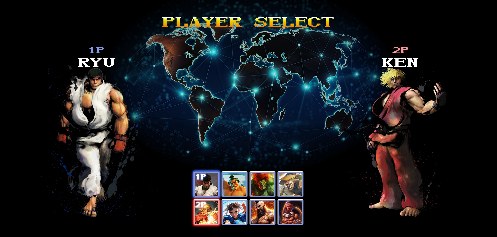
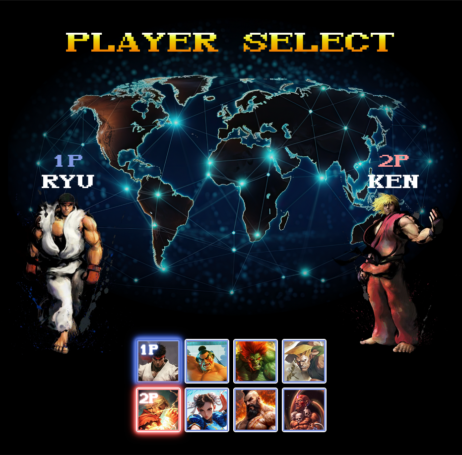
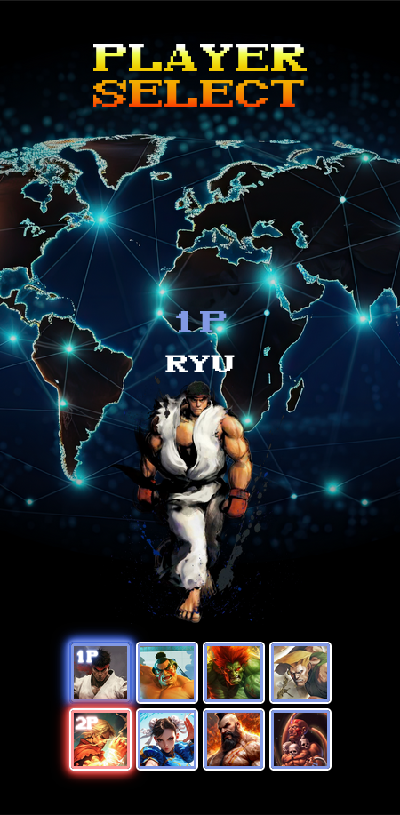

# Website – Character Selection Screen – Street Fighter II

Continuing my studies on html and css, I did this player selection screen website based on the Street Fighter II: The World Warrior game. After another project finished, now I'm starting on JS' studies to add some functionalities on my already done projects.

## Overview

### ⚔️ The challenge

- Build a character selection screen website based on the Street Fighter II: The World Warrior Game.

### 🖼 Printscreens

  
  

### 🖇️ Links

- Live Website (deploy): [https://trincode.github.io/character-selection-screen-sf2/](https://trincode.github.io/character-selection-screen-sf2/)
- Github repository: [https://github.com/trincode/character-selection-screen-sf2](https://github.com/trincode/character-selection-screen-sf2)

## My process

### Technologies

- HTML
- CSS

### Challenges and Concepts applieds

- Responsive Design
- CSS Flexbox

### What I learned

- To put a gradient color in the title "Player Select" in stylization I used the background-clip propriety:

```css
.header .title {
    background-image: linear-gradient(180deg, rgba(255,255,255,1) 3%, rgba(242,255,77,1) 14%, rgba(241,209,0,1) 31%, rgba(244,165,0,1) 58%, rgba(247,124,0,1) 75%, rgba(255,0,0,1) 100%);
    background-clip: text;
    -webkit-background-clip: text;
    -webkit-text-fill-color: transparent;
}
```

- And to make the blinking title "Player Select" based on some arcades' games:

First of all, I've got to create the animation titled by "blinking" changing the opacity:

```css
  @keyframes blinking {
    0% {
      opacity: 0;
    }

    100% {
      opacity: 1;
    }
  }
```

Then, added the animation in the title selector using the propriety "animation":

```css
.header .title {
    animation: blinking 0.9s infinite;
}
```

- To apply a glowing border animation to the character selected in the selectable characters' list and in its "1P" text (or 2P):

First, creating the animations:

```css
@keyframes c-glowing-blue {
    0% {
      box-shadow: 0 0 5px var(--light-blue), 0 0 5px var(--light-blue), 0 0 15px var(--light-blue), 0 0 20px var(--main-blue), 0 0 10px var(--main-blue), 0 0 10px var(--main-blue), 0 0 10px var(--main-blue), 0 0 10px var(--main-blue)
    }
  
    to {
      box-shadow: 0 0 2.5px var(--light-blue), 0 0 2.5px var(--light-blue), 0 0 7.5px var(--light-blue), 0 0 10px var(--main-blue), 0 0 5px var(--main-blue), 0 0 5px var(--main-blue), 0 0 5px var(--main-blue), 0 0 2px var(--main-blue)
    }
  }
  
  @keyframes c-glowing-red {
    0% {
      box-shadow: 0 0 5px var(--light-red), 0 0 5px var(--light-red), 0 0 15px var(--light-red), 0 0 20px var(--main-red), 0 0 10px var(--main-red), 0 0 10px var(--main-red), 0 0 10px var(--main-red), 0 0 10px var(--main-red)
    }
  
    to {
      box-shadow: 0 0 2.5px var(--main-red), 0 0 2.5px var(--main-red), 0 0 7.5px var(--main-red), 0 0 10px var(--main-red), 0 0 5px var(--main-red), 0 0 5px var(--main-red), 0 0 5px var(--main-red), 0 0 2px var(--main-red)
    }
  }
  
  @keyframes text-glowing-blue {
    0% {
      text-shadow: 0 0 1px var(--main-color), 0 0 1px var(--main-color), 0 0 1px var(--main-color), 0 0 1px var(--medium-blue), 0 0 5px var(--medium-blue), 0 0 2px var(--medium-blue), 0 0 10px var(--medium-blue), 0 0 10px var(--medium-blue)
    }
  
    to {
      text-shadow: 0 0 .5px var(--main-color), 0 0 .5px var(--main-color), 0 0 .5px var(--main-color), 0 0 .5px var(--medium-blue), 0 0 5px var(--medium-blue), 0 0 .5px var(--medium-blue), 0 0 5px var(--medium-blue), 0 0 2px var(--medium-blue)
    }
  }
  
  @keyframes text-glowing-red {
    0% {
      text-shadow: 0 0 1px var(--main-color), 0 0 1px var(--main-color), 0 0 1px var(--main-color), 0 0 1px var(--light-red), 0 0 5px var(--light-red), 0 0 2px var(--light-red), 0 0 10px var(--light-red), 0 0 10px var(--light-red)
    }
  
    to {
      text-shadow: 0 0 .5px var(--main-color), 0 0 .5px var(--main-color), 0 0 .5px var(--main-color), 0 0 .5px var(--light-red), 0 0 5px var(--light-red), 0 0 .5px var(--light-red), 0 0 5px var(--light-red), 0 0 2px var(--light-red)
    }
  }
```

Then, adding the animation propriety":

```css
.character-selection .characters-list .character.selected {
    border: 2px solid var(--medium-blue);
    animation: c-glowing-blue 0.7s ease-in-out infinite;
    animation-duration: alternate;
}

.character-selection .characters-list .character.selected .tag {
    display: block;
    animation: text-glowing-blue 0.7s ease-in-out infinite;
    animation-duration: alternate;
}

.character-selection .characters-list .character.player2-selected {
    animation: c-glowing-red 0.7s ease-in-out infinite;
    animation-duration: alternate;
}

.character-selection .characters-list .character.character.player2-selected .tag {
    display: block;
    animation: text-glowing-red 0.7s ease-in-out infinite;
    animation-duration: alternate;
}
```

### Continuous development

- Make possible to select another character for player one and two using JS.
- Show each character nationality flag while it's selected.

### Useful resources

No useful resources to point out.

## Author

- LinkedIn - [Clayton Trindade](https://www.linkedin.com/in/clayton-trindade-93b925329/)

- Instagram - [@trincode - Clayton Trindade](https://www.instagram.com/trincode/)

## Acknowledgments

My special thanks to [@roberto-hofstetter](https://github.com/roberto-hofstetter) and [@cadudias](https://github.com/cadudias), DevQuest's authors, the dev course that guided me to the knowledge which made that project possible.

---

# Site – Character Selection Screen – Street Fighter II

Dando continuidade aos meus estudos em html e css, fiz esse site de tela de seleção de jogadores baseado no jogo Street Fighter II: The World Warrior. Depois de mais um projeto finalizado, agora estou começando os estudos de JS para adicionar algumas funcionalidades nos meus projetos já feitos.

## Visão geral

### ⚔️ O desafio

- Crie um site de tela de seleção de personagens baseado no jogo Street Fighter II: The World Warrior.

## Meu processo

### Tecnologias

- HTML
- CSS

### Desafios e Conceitos aplicados

- Design Responsivo
- CSS Flexbox

### O que aprendi

- Para colocar uma cor gradiente no título "Player Select" na estilização usei a propriedade background-clip:

```css
.header .title {
    background-image: linear-gradient(180deg, rgba(255,255,255,1) 3%, rgba(242,255,77,1) 14%, rgba(241,209,0,1) 31%, rgba(244,165,0,1) 58%, rgba(247,124,0,1) 75%, rgba(255,0,0,1) 100%);
    background-clip: text;
    -webkit-background-clip: text;
    -webkit-text-fill-color: transparent;
}
```

- E para fazer o título piscante "Player Select" baseado em alguns jogos de fliperama:

Primeiro, criar a animação de nome "blinking" mudando a opacidade:

```css
  @keyframes blinking {
    0% {
      opacity: 0;
    }

    100% {
      opacity: 1;
    }
  }
```

Em seguida, adicionei a animação no seletor do título usando a propriedade "animation":

```css
.header .title {
    animation: blinking 0.9s infinite;
}
```

- To apply a glowing border animation to the character selected in the selectable characters' list and in its "1P" text (or 2P):

Criando as animações:

```css
@keyframes c-glowing-blue {
    0% {
      box-shadow: 0 0 5px var(--light-blue), 0 0 5px var(--light-blue), 0 0 15px var(--light-blue), 0 0 20px var(--main-blue), 0 0 10px var(--main-blue), 0 0 10px var(--main-blue), 0 0 10px var(--main-blue), 0 0 10px var(--main-blue)
    }
  
    to {
      box-shadow: 0 0 2.5px var(--light-blue), 0 0 2.5px var(--light-blue), 0 0 7.5px var(--light-blue), 0 0 10px var(--main-blue), 0 0 5px var(--main-blue), 0 0 5px var(--main-blue), 0 0 5px var(--main-blue), 0 0 2px var(--main-blue)
    }
  }
  
  @keyframes c-glowing-red {
    0% {
      box-shadow: 0 0 5px var(--light-red), 0 0 5px var(--light-red), 0 0 15px var(--light-red), 0 0 20px var(--main-red), 0 0 10px var(--main-red), 0 0 10px var(--main-red), 0 0 10px var(--main-red), 0 0 10px var(--main-red)
    }
  
    to {
      box-shadow: 0 0 2.5px var(--main-red), 0 0 2.5px var(--main-red), 0 0 7.5px var(--main-red), 0 0 10px var(--main-red), 0 0 5px var(--main-red), 0 0 5px var(--main-red), 0 0 5px var(--main-red), 0 0 2px var(--main-red)
    }
  }
  
  @keyframes text-glowing-blue {
    0% {
      text-shadow: 0 0 1px var(--main-color), 0 0 1px var(--main-color), 0 0 1px var(--main-color), 0 0 1px var(--medium-blue), 0 0 5px var(--medium-blue), 0 0 2px var(--medium-blue), 0 0 10px var(--medium-blue), 0 0 10px var(--medium-blue)
    }
  
    to {
      text-shadow: 0 0 .5px var(--main-color), 0 0 .5px var(--main-color), 0 0 .5px var(--main-color), 0 0 .5px var(--medium-blue), 0 0 5px var(--medium-blue), 0 0 .5px var(--medium-blue), 0 0 5px var(--medium-blue), 0 0 2px var(--medium-blue)
    }
  }
  
  @keyframes text-glowing-red {
    0% {
      text-shadow: 0 0 1px var(--main-color), 0 0 1px var(--main-color), 0 0 1px var(--main-color), 0 0 1px var(--light-red), 0 0 5px var(--light-red), 0 0 2px var(--light-red), 0 0 10px var(--light-red), 0 0 10px var(--light-red)
    }
  
    to {
      text-shadow: 0 0 .5px var(--main-color), 0 0 .5px var(--main-color), 0 0 .5px var(--main-color), 0 0 .5px var(--light-red), 0 0 5px var(--light-red), 0 0 .5px var(--light-red), 0 0 5px var(--light-red), 0 0 2px var(--light-red)
    }
  }
```

E então, adicionando a animação no seletor:

```css
.character-selection .characters-list .character.selected {
    border: 2px solid var(--medium-blue);
    animation: c-glowing-blue 0.7s ease-in-out infinite;
    animation-duration: alternate;
}

.character-selection .characters-list .character.selected .tag {
    display: block;
    animation: text-glowing-blue 0.7s ease-in-out infinite;
    animation-duration: alternate;
}

.character-selection .characters-list .character.player2-selected {
    animation: c-glowing-red 0.7s ease-in-out infinite;
    animation-duration: alternate;
}

.character-selection .characters-list .character.character.player2-selected .tag {
    display: block;
    animation: text-glowing-red 0.7s ease-in-out infinite;
    animation-duration: alternate;
}
```

### Desenvolvimento contínuo

- Torna possível selecionar outro personagem para o jogador um e dois usando JS.
- Mostra a bandeira de nacionalidade de cada personagem enquanto ele está selecionado.

### Recursos úteis

Sem recursos úteis para citar.

## Autor

- LinkedIn - [Clayton Trindade](https://www.linkedin.com/in/clayton-trindade-93b925329/)

- Instagram - [@trincode - Clayton Trindade](https://www.instagram.com/trincode/)

## Agradecimentos

Meus agradecimentos aos [@roberto-hofstetter](https://github.com/roberto-hofstetter) e [@cadudias](https://github.com/cadudias), criadores do DevQuest, curso no qual aprendi a maioria dos conhecimentos utilizados aqui nesse projeto!